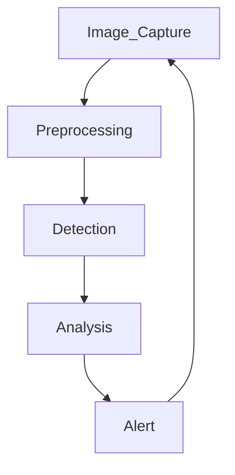

<picture>
 <source media="(prefers-color-scheme: dark)" srcset="https://i.pinimg.com/1200x/9d/d8/88/9dd888584a7891413b880a3770e04ddf.jpg">
 <source media="(prefers-color-scheme: light)" srcset="https://i.pinimg.com/1200x/9d/d8/88/9dd888584a7891413b880a3770e04ddf.jpg">
 
</picture>   

> [!IMPORTANT]
> This is awork in progress.

# Hive Defender 🐝

## An Intelligent System for Hive Threat Detection

## Introduction

**Hive Defender** is an innovative project developed during the second half of 2024 as part of the ENTEC technology event, promoted by the University of Uberaba (Uniube). Our main objective is to monitor the health and integrity of bees in specific hives in real-time, using advanced computer vision and artificial intelligence techniques.

Bees play a crucial role in pollination and maintaining ecosystem balance. However, they face increasing threats, with the *Varroa destructor* mite being one of the most significant dangers to colony survival. Hive Defender was designed to combat this threat and, in the future, expand detection to other risks that compromise bee health.

## Project Structure

Hive Defender utilizes a **YOLOv8 object detection** model, trained with a dataset of approximately 500 to 600 images capturing the presence of *Varroa destructor* in hives. Through automatic visual analysis, the model identifies the presence of the mite in real-time, issuing alerts for early intervention.

The choice of YOLOv8 is based on its balance between accuracy and speed, essential for real-time monitoring. The model is integrated into a pipeline that processes images captured directly from hives, detecting anomalies that may represent a threat to the bees' well-being.

### Algorithm Workflow

1. **Image Capture:** High-resolution cameras (Maybe sensors too?) installed in the hives continuously capture images.
     2. **Preprocessing:** The images are resized and normalized for input into the model.
          3. **Detection:** The YOLOv8 model processes the images, identifying potential *Varroa destructor* mites.
               4. **Analysis:** Detection results are analyzed to determine the presence and extent of infestation.
                    5. **Alert:** If a threat is detected, an alert is generated and sent to the beekeeper via a notification system.

## Possible Adjustments and Improvements

While Hive Defender has already shown promising results, there is always room for improvement:

1. **Dataset Expansion:**
   - Significantly increase the number of training images.
   - Incorporate greater diversity in images (lighting conditions, angles, contexts).

2. **Enhancement of Computer Vision Model:**
   - Consider more powerful models like EfficientDet or transformer-based networks.
   - Optimize hyperparameters to improve accuracy without sacrificing speed.

3. **Advanced Hardware Utilization:**
   - Implement more powerful GPUs for higher-resolution image processing and speed.
   - Invest in higher-quality cameras to capture finer details.

4. **Improvement in Image Quality:**
   - Optimize the quality of training and capture images.
   - Implement data augmentation techniques to enhance model robustness.

5. **Integration of Additional Sensors:**
   - Incorporate temperature, humidity, and sound sensors for a more comprehensive analysis of hive health.

6. **User Interface Development:**
   - Create an intuitive dashboard for beekeepers to monitor their hives in real-time.

## References

- Neumann, P., & Carreck, N. L. (2010). "Honey bee colony losses." *Journal of Apicultural Research*, 49(1), 1-6. [DOI:10.3896/IBRA.1.49.1.01](https://doi.org/10.3896/IBRA.1.49.1.01)
- Rosenkranz, P., Aumeier, P., & Ziegelmann, B. (2010). "Biology and control of *Varroa destructor*." *Journal of Invertebrate Pathology*, 103, S96-S119. [DOI:10.1016/j.jip.2009.07.016](https://doi.org/10.1016/j.jip.2009.07.016)
- Bochkov, A. V. et al. (2023). "Acarine parasites of honey bees." *International Journal of Acarology*, 49(3), 175-193. [DOI:10.1080/01647954.2023.1900524](https://doi.org/10.1080/01647954.2023.1900524)
- Bochkov, A. V. et al. (2022). "Precision farming in apiculture: Artificial intelligence for honey bee colony monitoring." *Agricultural Systems*, 196, 103327. [DOI:10.1016/j.agsy.2021.103327](https://doi.org/10.1016/j.agsy.2021.103327)
- Redmon, J., & Farhadi, A. (2018). "YOLOv3: An incremental improvement." *arXiv preprint arXiv:1804.02767*. [arXiv:1804.02767](https://arxiv.org/abs/1804.02767)

## Conclusion

Hive Defender will represent a significant step in applying cutting-edge technologies for bee preservation. By identifying and alerting about the presence of threats like the *Varroa destructor*, the system contributes to maintaining hive health, crucial for pollination and environmental balance.

This project not only aims to offers a practical solution to an urgent problem but also serves as a learning platform for deepening knowledge in AI and computer vision applied to environmental preservation. In the future, Hive Defender has the potential to expand to include the detection of other threats, further contributing to the protection of these vital insects.

>This is my first project in the field of Computer Vision, don't expect to see anything fancy here.*
